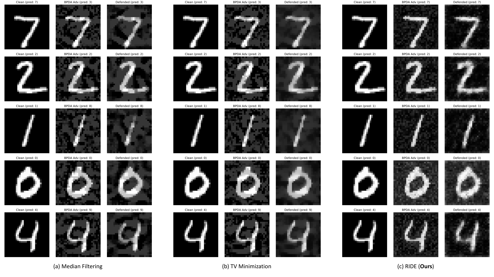

<!--
Copyright (C) 2019, 2023 Mitsubishi Electric Research Laboratories (MERL)

SPDX-License-Identifier: AGPL-3.0-or-later
-->

# White-Box Adversarial Defense via Self-Supervised Data Estimation

## Introduction

Deep learning classifiers are vulnerable to adversarial attacks that only introduce quasi-imperceptible perturbations to the input images, but can completely change the predictions. Here we proposed to use a **functional**, which is a *function of functions* to defense against adversarial attacks under the white-box setting. Specifically, we propose the **robust iterative data estimation (RIDE)** algorithm that returns a defender function for every individual adversarial image through the self-supervised optimization of a neural network. Our defender achieves state-of-the-art defense performance on image recognition. For details, please read the [preprint](https://arxiv.org/pdf/xxxx.xxxxx.pdf).

*Note*: work was done during an internship at Mitsubishi Electric Research Laboratories (MERL).

## Examples



Qualitative results of the defense against 10-iteration white-box attack (PGD attack with BPDA) on MNIST dataset using (a) median filtering, (b) total-variance minimization and (c) the proposed RIDE algorithm. The predicted label of each image is shown on top of it.


## Citation

If you use the software, please cite the following:

```BibTeX
@article{Zhang2019sep,
author = {Zhang, Ziming and Lin, Zudi and Pfister, Hanspeter},
title = {White-Box Adversarial Defense via Self-Supervised Data Estimation},
journal = {arXiv},
year = 2019,
month = sep,
url = {https://arxiv.org/abs/1909.06271}
}
```

## Contact

Anthony Vetro <avetro@merl.com>

## Contributing

See [CONTRIBUTING.md](CONTRIBUTING.md) for our policy on contributions.

## License

Released under `AGPL-3.0-or-later` license, as found in the [LICENSE.md](LICENSE.md) file.

All files:

```
Copyright (C) 2019, 2023 Mitsubishi Electric Research Laboratories (MERL).

SPDX-License-Identifier: AGPL-3.0-or-later
```
